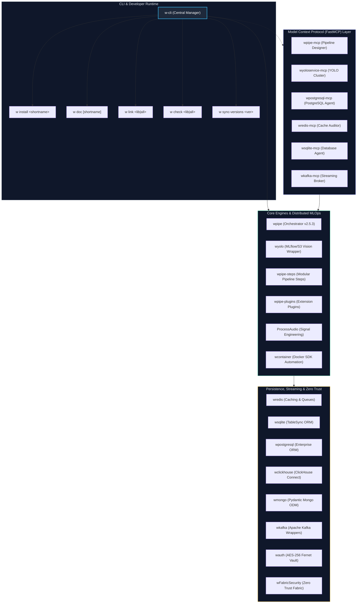

# 🧱 Wisrovi Libraries Suite Central CLI Manager (`w-cli`)

<p align="center">
  <a href="https://pypi.org/user/wisrovi/"></a>
  <a href="https://orcid.org/0009-0005-0710-1861"></a>
  <a href="https://wisrovi.dev"></a>
  <a href="https://github.com/wisrovi/w-cli"></a>
  <a href="https://github.com/wisrovi/w-cli"></a>
</p>

A unified command-line interface, workspace orchestrator, documentation indexer, and environment auditor for the **wisrovi Software Suite**.

Architected by **William Steve Rodriguez Villamizar (wisrovi)**, `w-cli` coordinates **37 total architectural components** across the ecosystem, distinguishing between **23 live packages published on PyPI** and **14 active enterprise development modules**. It standardizes local editable package linking, static code quality gating (`ruff`, `bandit`), semantic version synchronization across monorepos, and Model Context Protocol (MCP) integrations for autonomous agentic workflows.

---

## 🏛️ Ecosystem Architecture & Interaction Topology



---

## 📊 Complete Libraries Catalog (37 Total Components)

The suite is partitioned into two clear tiers: **Live Published PyPI Packages** and **Active Development / Internal Modules**.

### Tier 1: 23 Live Packages Published on PyPI

| Short Name | Official Package | PyPI Version | Registry Endpoint | Technical Focus |
| :--- | :--- | :--- | :--- | :--- |
| **`pipe`** / **`pipeline`** | `wpipe` | [](https://pypi.org/project/wpipe/) | [PyPI](https://pypi.org/project/wpipe/) | High-performance Python pipeline orchestrator (Sync/Async). |
| **`pipe-steps`** | `wpipe-steps` | [](https://pypi.org/project/wpipe-steps/) | [PyPI](https://pypi.org/project/wpipe-steps/) | Production-ready modular execution steps for `wpipe`. |
| **`pipe-plugins`** | `wpipe-plugins` | [](https://pypi.org/project/wpipe-plugins/) | [PyPI](https://pypi.org/project/wpipe-plugins/) | Plugin architecture for dynamic pipeline step registration. |
| **`pipe-mcp`** | `wpipe-mcp` | [](https://pypi.org/project/wpipe-mcp/) | [PyPI](https://pypi.org/project/wpipe-mcp/) | FastMCP Server for AI agent pipeline design and verification. |
| **`yolo`** | `wyolo` | [](https://pypi.org/project/wyolo/) | [PyPI](https://pypi.org/project/wyolo/) | MLflow and S3 YOLO/RT-DETR lifecycle training wrapper. |
| **`yolo-mcp`** | `wyoloservice-mcp` | [](https://pypi.org/project/wyoloservice-mcp/) | [PyPI](https://pypi.org/project/wyoloservice-mcp/) | FastMCP Server for NeuralForgeAI YOLO cluster orchestration. |
| **`audio`** | `ProcessAudio` | [](https://pypi.org/project/ProcessAudio/) | [PyPI](https://pypi.org/project/ProcessAudio/) | Scikit-learn audio feature transformers and spectrogram pipelines. |
| **`redis`** | `wredis` | [](https://pypi.org/project/wredis/) | [PyPI](https://pypi.org/project/wredis/) | Sync/async Redis pooling, cache decorators, and rate limiters. |
| **`redis-mcp`** | `wredis-mcp` | [](https://pypi.org/project/wredis-mcp/) | [PyPI](https://pypi.org/project/wredis-mcp/) | FastMCP Server for Redis cache auditing and key inspection. |
| **`sqlite`** | `wsqlite` | [](https://pypi.org/project/wsqlite/) | [PyPI](https://pypi.org/project/wsqlite/) | TableSync schema generator, Pydantic v2 ORM, and WAL support. |
| **`sqlite-mcp`** | `wsqlite-mcp` | [](https://pypi.org/project/wsqlite-mcp/) | [PyPI](https://pypi.org/project/wsqlite-mcp/) | FastMCP Server for SQLite database inspection and queries. |
| **`postgresql`** | `wpostgresql` | [](https://pypi.org/project/wpostgresql/) | [PyPI](https://pypi.org/project/wpostgresql/) | PostgreSQL connection pooler and enterprise ORM mapper. |
| **`postgresql-mcp`** | `wpostgresql-mcp` | [](https://pypi.org/project/wpostgresql-mcp/) | [PyPI](https://pypi.org/project/wpostgresql-mcp/) | FastMCP Server for PostgreSQL AI agent integration. |
| **`clickhouse`** | `wclickhouse` | [](https://pypi.org/project/wclickhouse/) | [PyPI](https://pypi.org/project/wclickhouse/) | ClickHouse ORM mapping using clickhouse-connect. |
| **`mongo`** | `wmongo` | [](https://pypi.org/project/wmongo/) | [PyPI](https://pypi.org/project/wmongo/) | MongoDB document mapper utilizing Pydantic models. |
| **`kafka`** | `wkafka` | [](https://pypi.org/project/wkafka/) | [PyPI](https://pypi.org/project/wkafka/) | Decorator-based streaming wrapper for Apache Kafka producers/consumers. |
| **`kafka-mcp`** | `wkafka-mcp` | [](https://pypi.org/project/wkafka-mcp/) | [PyPI](https://pypi.org/project/wkafka-mcp/) | FastMCP Server for Kafka event streaming and topic inspection. |
| **`auth`** | `wauth` | [](https://pypi.org/project/wauth/) | [PyPI](https://pypi.org/project/wauth/) | Machine-salted hardware fingerprint encryption vault (AES-256 Fernet). |
| **`fabric`** | `wFabricSecurity` | [](https://pypi.org/project/wfabricsecurity/) | [PyPI](https://pypi.org/project/wfabricsecurity/) | Zero Trust security system for Hyperledger Fabric (ECDSA P-256). |
| **`container`** | `wcontainer` | [](https://pypi.org/project/wcontainer/) | [PyPI](https://pypi.org/project/wcontainer/) | Docker SDK automation utility for container lifecycle orchestration. |
| **`decorators`** | `wdecorators` | [](https://pypi.org/project/wdecorators/) | [PyPI](https://pypi.org/project/wdecorators/) | High-level reusable decorators for profiling, retries, and caching. |
| **`utils`** | `wutils` | [](https://pypi.org/project/wutils/) | [PyPI](https://pypi.org/project/wutils/) | Common script scheduling, date math, and format checkers. |
| **`wisrovi`** | `wisrovi-python` | [](https://pypi.org/project/wisrovi-python/) | [PyPI](https://pypi.org/project/wisrovi-python/) | Foundational Python algorithmic utilities and suite helpers. |

### Tier 2: 14 Active Development / Internal Modules

| Short Name | Module Name | Type | Status | Technical Scope |
| :--- | :--- | :--- | :--- | :--- |
| **`cli`** | `w-cli` | Utility CLI | Active Dev | Central suite CLI manager, linter, and monorepo link orchestrator. |
| **`pipe-api`** | `wpipe-api` | Microservice | Internal | FastAPI process monitoring and live telemetry backend. |
| **`agents`** | `wAgents` | AI Workspace | Active Dev | CUDA-accelerated Docker workspace for multi-agent reasoning. |
| **`elasticsearch`** | `wElasticsearch` | Database ORM | Active Dev | Pydantic v2 document mapping for Elasticsearch clusters. |
| **`snowflake`** | `wSnowflake` | Cloud Datastore | Active Dev | Dynamic Snowflake SQL client and schema mapper. |
| **`databricks`** | `wdatabricks` | Cloud Datastore | Active Dev | Databricks SQL execution engine and DataFrame wrapper. |
| **`mysql`** | `wmysql` | Database ORM | Active Dev | High-throughput MySQL Pydantic ORM wrapper. |
| **`mariadb`** | `wmariadb` | Database ORM | Active Dev | MariaDB connection pooling and query builder. |
| **`nats`** | `wnats` | Message Broker | Active Dev | High-performance NATS pub/sub and JetStream streaming wrapper. |
| **`zeromq`** | `wzeroMQ` | IPC / Networking | Active Dev | Low-latency IPC/TCP sockets utilizing ZeroMQ. |
| **`messenger`** | `wmessenger` | Communications | Active Dev | Unified client gateway for Telegram, WhatsApp, and Slack alerts. |
| **`ticket`** | `wticket` | Enterprise App | Active Dev | Dynamic SLA ticketing engine. Live demo: [wticket.wisrovi.dev](https://wticket.wisrovi.dev/). |
| **`image`** | `wimage` | Computer Vision | Active Dev | High-performance image transform, crop, and augment utility. |
| **`wonka`** | `wWonka` | Helper Library | Internal | Monorepo internal utilities and experimental prototypes. |

---

## 🚀 Quickstart & Installation

Install `w-cli` directly via pip or clone locally in editable development mode:

```bash
# Clone the repository
git clone https://github.com/wisrovi/w-cli.git
cd w-cli

# Install in editable mode to register the 'w' executable in your PATH
pip install -e .
```

Verify your setup:

```bash
w --help
```

---

## ⌨️ Command Reference

The `w` command provides an intuitive sub-command routing interface:

### 1. `w install <library|all>`
Installs target libraries from the suite, automatically detecting the active package manager (`pip`, `poetry`, or `pipenv`):

```bash
# Install individual packages via shortname mapping
w install redis        # Resolves to wredis
w install sqlite       # Resolves to wsqlite
w install pipe         # Resolves to wpipe
w install yolo-mcp     # Resolves to wyoloservice-mcp

# Install all suite libraries
w install all
```

### 2. `w doc [library]`
Inspects documentation cards or opens official PyPI / ReadTheDocs portals directly in your browser:

```bash
# Interactive table mapping all 37 packages and doc endpoints
w doc

# Open browser directly to wpipe documentation
w doc pipe

# Inspect metadata card in terminal without opening browser
w doc redis --no-open
```

### 3. `w search <query>`
Searches the package inventory across short names, package names, and functional descriptions:

```bash
w search database
w search mcp
w search yolo
```

### 4. `w status`
Audits the active Python environment and reports which suite packages are installed locally along with their live versions:

```bash
w status
```

### 5. `w link <library|all>`
Links local sibling directories inside a monorepo in editable mode (`pip install -e <path>`), accelerating local development loops:

```bash
# Link local wredis development folder
w link redis

# Auto-discover and link all sibling packages with pyproject.toml or setup.py
w link all
```

### 6. `w check <library|all>`
Executes static analysis and security vulnerability audits using `ruff` and `bandit`:

```bash
# Audit specific package
w check redis

# Audit all packages across the monorepo root
w check all
```

### 7. `w sync-versions <version>`
Synchronizes semantic version tags across all `pyproject.toml` files in the monorepo workspace:

```bash
w sync-versions 2.5.0
```

### 8. `w create <pipeline|docker-test>`
Scaffolds boilerplate architectures complying with suite engineering standards:

```bash
# Generate high-performance wpipe DAG script
w create pipeline --name distributed_ingestion

# Generate isolated Docker testing environment and pytest boilerplate
w create docker-test
```

### 9. Shell Completion
Enables native bash / zsh auto-completion:

```bash
w --install-completion
```

---

## 🧪 Testing & Quality Assurance

The test suite runs with 100% pass rate under `pytest`, validating CLI dispatch, subprocess sandboxing, and packaging manager detection:

```bash
# Run pytest directly
pytest -v

# Run tests with code coverage metrics
pytest --cov=module --cov-report=term-missing
```

---

## 👤 Author & Research Affiliation

Architected and maintained by:
* **William Steve Rodriguez Villamizar (wisrovi)**
* **Role:** Principal AI Engineer & Applied AI Solutions Architect | Scientific Researcher
* **Portal:** [wisrovi.dev](https://wisrovi.dev)
* **ORCID:** [0009-0005-0710-1861](https://orcid.org/0009-0005-0710-1861)
* **PyPI:** [pypi.org/user/wisrovi/](https://pypi.org/user/wisrovi/)
* **GitHub:** [@wisrovi](https://github.com/wisrovi)

---

## 📜 License

Distributed under the **MIT License**. Open for industrial collaboration and scientific research.